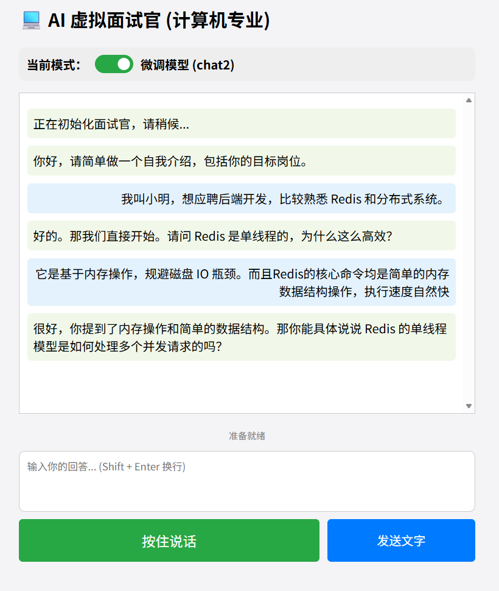
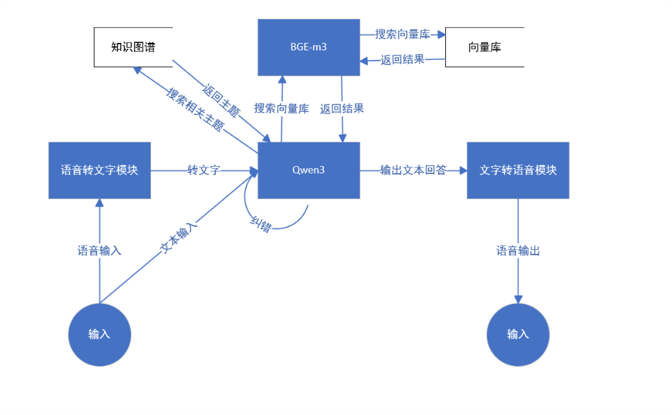

# 计算机科学技术（CS）虚拟面试官 - 后端核心系统

本项目是《大模型基础与应用》课程的期末作业。系统基于 **Spring Boot 3.5.9** 和 **Spring AI** 构建，集成本地微调大模型、RAG（检索增强生成）与知识图谱技术，提供具备“听、说、想、评”能力的端到端智能面试模拟体验。

---
## 界面展示

## 系统架构

系统采用微服务化思想，所有核心组件均实现本地化或容器化部署，确保了数据隐私与响应实时性。

### 1. 整体业务流
`前端输入 (语音/文字) -> 后端调度 (Spring Boot) -> 语义纠错 (LLM) -> 知识检索 (Hybrid RAG) -> 决策生成 (Local LLM) -> 语音合成 (TTS) -> 前端输出 (语音+文字) `


### 2. 核心技术栈
*   **应用框架**: Spring Boot 3.5.9, Spring AI (Milestone 4)
*   **推理引擎**: Ollama (本地部署微调 Qwen3 模型)
*   **向量库**: ChromaDB (Docker 容器化)
*   **语义嵌入**: BGE-M3 (via SiliconFlow API)
*   **语音识别 (STT)**: Faster-Whisper (Docker 容器化)
*   **语音合成 (TTS)**: Edge-TTS (Docker 容器化)

---

## 快速开始：环境部署

要运行本项目，你需要启动以下四个核心服务组件。

### 第一步：获取并启动 Docker 容器
系统依赖三个独立封装的 Docker 容器。请确保已安装 **Docker Desktop**。

1.  **ChromaDB (向量数据库)**
    注意：my_vector_db文件夹及其内容由/data_engineering中的脚本生成。构建python 环境时，ChromaDB 请使用 `0.5.20` 版本以确保 API 兼容性。。
    ```bash
    docker run -d --name chromadb -p 8001:8000 -v /你的路径/my_vector_db:/chroma/chroma chromadb/chroma:0.5.20
    ```

2.  **Faster-Whisper (STT 引擎)**
    ```bash
    docker run -d --name whisper-server -p 8000:8000 fedirz/faster-whisper-server:latest-cpu
    ```

3.  **Edge-TTS (TTS 引擎)**
    进入 `tts_module` 目录，构建并运行：
    ```bash
    docker build -t edge-tts-server .
    docker run -d --name tts-service -p 5000:5000 edge-tts-server
    ```

### 第二步：部署本地大模型 (Ollama)
1. 安装 Ollama 并启动服务(安装后要重启)，参考官方文档：https://ollama.com/docs/installation
2. 下载Qwen3:8b原始模型，命令如下(在powershell中输入即可)：
    ```bash
    ollama run qwen3:8b
    ```
3.  下载微调后的 `.gguf` 文件。它是由/model_finetuning下的脚本导出微调后的模型文件。
4.  在文件同级目录创建 `Modelfile`，内容参考如下：
    ```dockerfile
        # 1. 指定本地 GGUF 文件的路径 (请确保路径正确，建议用绝对路径)
        FROM "./qwen3_interview_q4_k_m.gguf"

        # 2. 设置 ChatML 模板 (Qwen 系列标准模板)
        TEMPLATE """{{ if .System }}<|im_start|>system
        {{ .System }}<|im_end|>
        {{ end }}{{ if .Prompt }}<|im_start|>user
        {{ .Prompt }}<|im_end|>
        {{ end }}<|im_start|>assistant
        """

        # 3. 固化 System Prompt (训练时使用的那个)
        SYSTEM """你是一位专业的计算机专业面试官，风格严谨，喜欢追问底层原理。请根据候选人的回答进行追问或点评。面试中对话不超过10轮，完成面试时面试官主动结束并给出打分和点评。"""

        # 4. 设置生成参数 (参考你训练/Chat脚本中的参数)
        PARAMETER stop "<|im_start|>"
        PARAMETER stop "<|im_end|>"
        PARAMETER temperature 0.7
        PARAMETER top_p 0.9
    ```
5.  执行创建命令（请使用下面命令中的命名，不要自行更改!）：
    ```bash
    ollama create interviewer-qwen3 -f Modelfile
    ```

### 第三步：后端项目配置
1. 请确保安装了 **Java 17+** 和 **Maven 3.8+**。
2. 克隆本仓库并导入 IDE（如 IntelliJ IDEA）。
3. 修改 `src/main/resources/application.properties`：注意，请根据你的实际情况修改 API Key 及路径等配置项。
   ```properties
      # =========================================================
      # 1. 基础项目配置
      # =========================================================
      spring.application.name=interviewer-controller

      # 关键配置：允许 Bean 定义覆盖。
      # 必须开启，否则我们手动配置的 VectorStore (在 AppConfig 中) 无法替换 Spring AI 默认生成的 Bean。
      spring.main.allow-bean-definition-overriding=true

      # =========================================================
      # 2. 本地推理引擎：Ollama (运行 Qwen 聊天模型)
      # =========================================================
      # 本地 Ollama 服务地址
      spring.ai.ollama.base-url=http://localhost:11434

      # 聊天模型选择
      # 微调模型使用: interviewer-qwen3 | 原始模型使用: qwen3:8b
      spring.ai.ollama.chat.options.model=qwen3:8b

      # 采样参数设置
      spring.ai.ollama.chat.options.temperature=0.7
      spring.ai.ollama.chat.options.top-p=0.9

      # 关键适配：设置停止符，防止微调模型由于模板不匹配导致的“复读机”或持续输出
      spring.ai.ollama.chat.options.stop=<|im_start|>,<|im_end|>

      # 明确启用 Ollama 聊天功能
      spring.ai.ollama.chat.enabled=true

      # =========================================================
      # 3. 云端 Embedding 服务：SiliconFlow (OpenAI 协议兼容)
      # =========================================================
      # 这里的 Key 会被 Spring AI 用于所有 OpenAI 相关的自动配置组件
      spring.ai.openai.api-key=你的API_KEY
      # 注意：Base URL 结尾不要加 /v1，Spring AI 会自动补全路径
      spring.ai.openai.base-url=https://api.siliconflow.cn

      # 明确指定 Embedding 专用 Base-URL
      spring.ai.openai.embedding.base-url=https://api.siliconflow.cn

      # 关键修复：禁用 OpenAI 启动器中的冗余模块
      # 仅保留 Embedding 向量化功能，关闭聊天、绘图、语音，防止 Bean 冲突和 API-Key 校验失败
      spring.ai.openai.chat.enabled=false
      spring.ai.openai.image.enabled=false
      spring.ai.openai.audio.speech.enabled=false
      spring.ai.openai.audio.transcription.enabled=false

      # 嵌入模型选择：必须与数据组构建向量库时使用的模型 (Pro/BAAI/bge-m3) 严格对齐
      spring.ai.openai.embedding.options.model=Pro/BAAI/bge-m3

      # 彻底禁用 Ollama 自带的向量化功能，防止系统内出现两个 EmbeddingModel 导致注入失败
      spring.ai.ollama.embedding.enabled=false

      # =========================================================
      # 4. 向量数据库：Chroma (Docker 容器化部署)
      # =========================================================
      # 后端通过 8001 端口访问 Docker 容器中的 ChromaDB
      # 注：由于我们在 AppConfig 里手动注入了 Bean，此处的 URL 仅作备查
      spring.ai.vectorstore.chroma.client.base-url=http://localhost:8001

      # =========================================================
      # 5. 多模态组件及 Web 文件控制
      # =========================================================
      # 语音转文字 (STT) 容器地址：由 Faster-Whisper 提供
      engines.stt.url=http://localhost:8000/v1/audio/transcriptions

      # 文字转语音 (TTS) 容器地址：由 Edge-TTS 桥接服务提供
      engines.tts.url=http://localhost:5000/tts

      # Web 上传大小限制：防止因音频文件过大导致的上传失败 (默认 1MB 改为 10MB)
      spring.servlet.multipart.max-file-size=10MB
      spring.servlet.multipart.max-request-size=10MB
   ```
4. 修改`src/main/java/com/example/interviewer_controller/service/GraphKnowledgeService.java`中的知识图谱数据路径为你本地的实际路径。知识图谱文件也由/data_engineering中的脚本生成。
```java
   // 加载知识图谱 JSON 文件
   this.allTriplets = mapper.readValue(
        new File("你的路径/knowledge_graph.json"),
        new TypeReference<List<Triplet>>(){}
   );
```

## 第四步，运行后端服务
1. 首先在Docker中启动上述三个容器，然后在IDE（如IntelliJ IDEA）中运行 `com.example.interviewer_controller.InterviewerControllerApplication` 主类，启动 Spring Boot 服务。
2. 打开浏览器，输入 `http://localhost:8080/index.html` 访问前端页面，开始体验智能面试官。

---

## 核心亮点 (Key Features)

### 1. Hybrid RAG 检索机制
结合了**知识图谱的逻辑导航**与**向量库的语义深度**。
*   **实体锚定**: 利用 LLM 提取用户回答中的技术实体。
*   **图谱跳转**: 在图谱中寻找邻居节点，驱动面试话题的“顺藤摸瓜”式演进。
*   **双重回退 (Fallback)**: 当图谱路径断裂时，自动切换回全局岗位大纲，保证面试不冷场。

### 2. 上下文感知的语义纠错 (Correction Layer)
针对语音识别（STT）对专业术语（如 JVM, ZooKeeper）识别率低的问题，系统利用“上一轮问题”作为先验上下文，通过大模型对转写文本进行实时二次校准，大幅提升了垂直领域的交互准确性。

### 3. 双模驱动架构 (A/B Testing)
*   **模式 A (Base + Logic)**: 利用复杂的 Java 状态机与 Prompt Chaining 驱动。
*   **模式 B (Fine-tuned)**: 利用微调后的模型自主控场，实现更自然的 End-to-End 对话。

### 4. 跨轮次反馈评价系统
系统实现了“延迟对比”逻辑：在 $N$ 轮预存问题标准答案，在 $N+1$ 轮用户回答后调取该答案进行精准技术点评。

---

## 📂 项目结构
```text
interviewer-controller/
├── src/main/java/com/example/interviewer_controller/
│   ├── config/             # Spring Bean 手动配置 (ChromaDB 注入)
│   ├── controller/         # REST API 接口 (处理语音/文字请求)
│   ├── service/            # 核心业务逻辑
│   │   ├── InterviewService.java   # 状态机与 RAG 调度引擎
│   │   ├── GraphKnowledgeService.java # 知识图谱导航
│   │   └── SpeechService.java      # STT/TTS 容器通信
|   |   └── InterviewSession.java     # 面试会话状态管理
│   └── model/              # 知识图谱数据实体
└── src/main/resources/
    ├── static/             # 前端 Web 交互界面 (index.html)
    └── application.properties # 系统全局配置

Qwen3_model/
├── Modelfile  # Ollama 微调模型定义文件
└── qwen3_interview_q4_k_m.gguf  # 微调后的 GGUF 模型文件,这里需要自行下载我们提供的gguf文件,放在该目录下，执行部署的第二步的第5点

tts_module/
├── Dockerfile  # Edge-TTS 容器构建文件
├── requirements.txt  # 声明依赖
└── tts_server.py  # TTS 服务实现脚本

README.md  # 本说明文档
```

---

## 📝 许可证
本项目仅用于学术交流与课程提交。