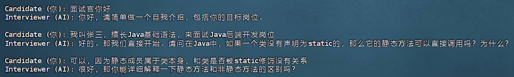
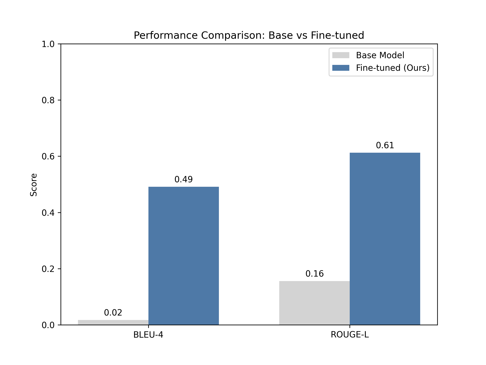

# 🤖 CS Interviewer Agent - Qwen3-8B Finetuning

本目录包含了**计算机模拟面试官智能体**的核心微调代码与工程化脚本。

本项目基于 **Qwen3-8B** 基座模型，使用 **LoRA (Low-Rank Adaptation)** 技术进行指令微调 (SFT)，旨在构建一个**风格严谨、善于追问底层原理、并能主动结束面试进行点评**的专业面试官智能体。

## 📂 文件结构说明

| 文件名 | 类型 | 说明 |
| :--- | :--- | :--- |
| `train.py` | 训练脚本 | 基于 PEFT 实现 LoRA 微调，集成 **SwanLab** 进行 Loss 实时监控与可视化。 |
| `chat.py` | 推理脚本 | 加载微调后的 Adapter 权重，提供命令行交互界面进行模拟面试测试。 |
| `compare_models.py` | 评估脚本 | 对比 Base 模型与微调模型在测试集上的表现，计算 BLEU-4 和 ROUGE-L 指标。 |
| `export_model.py` | 导出脚本 | 将 LoRA 权重与基座模型合并 (Merge & Unload)，为后续 GGUF 转换做准备。 |
| `Modelfile.txt` | 配置文件 | 适配 **Ollama** 的模型配置文件，定义了 ChatML 模板、System Prompt 及推理参数。 |
| `loss_curve.png` | 结果图表 | 训练过程中的 Loss 收敛曲线图。 |
| `comparison_chart.png` | 结果图表 | 微调前后客观指标对比柱状图。 |
| `chat.jpg` | 演示截图 | 实际对话效果截图。 |

## 🛠️ 环境准备

本项目在 Linux 服务器 (NVIDIA RTX 3090, 48GB VRAM) 上开发。核心依赖如下：

`pip install torch transformers peft datasets pandas matplotlib swanlab modelscope rouge nltk`

## 🚀 工作流 (Workflow)

### 1. 模型微调 (Training)

运行 `train.py` 启动训练。该脚本会自动下载 Qwen3-8B 模型，加载 `interview_data.json` 数据集，并开启 LoRA 训练。

* **配置**: Rank=32, Alpha=64, Epochs=2, bf16 混合精度。
* **监控**: 训练过程中自动记录 Loss 并在结束时生成 `loss_curve.png`。

### 2. 对话测试 (Chat)

训练完成后，运行 `chat.py` 进行端到端的人机交互测试。脚本会自动查找 `output` 目录下最新的 checkpoint 并加载。

* **特性**: 模拟真实面试流程，支持多轮对话与追问逻辑。

> **效果展示**：
> 模型能够识别 System Prompt，针对“Java后端”等技术点进行深度追问。
> 

### 3. 效果评估 (Evaluation)

运行 `compare_models.py` 对比微调前后的模型表现。

* **指标提升**:
    * **BLEU-4**: 0.02 → **0.49** (显著提升指令遵循能力)
    * **ROUGE-L**: 0.16 → **0.61** (显著提升回复内容的逻辑完整性)
* **输出**: 生成 `comparison_chart.png` 和详细的 Excel 对比报告。

### 4. 模型导出与合并 (Export)

为了进行工程化部署，运行此脚本将 LoRA 权重融合进基座模型，保存为完整模型文件。

* **输出目录**: `../qwen3_train/qwen3_interview_merged`
* 此步骤消除了推理时的 Adapter 加载延迟，为 GGUF 转换奠定基础。

## 📦 模型量化与部署 (Deployment)

本项目最终采用 **GGUF** 格式配合 **Ollama** 进行低资源推理部署，实现了从 16GB (FP16) 到 ~5GB (Int4) 的轻量化落地。

### 1. GGUF 转换与量化
我们使用 `llama.cpp` 工具链将合并后的模型转换为 GGUF 格式，并采用 **Q4_K_M** 混合精度量化策略：
* 关键层 (Attention V, Output) 保留高精度。
* 非关键层进行 4-bit 压缩。

### 2. Ollama 部署
使用仓库中提供的 `Modelfile` 构建本地运行环境：

FROM ./qwen3_interview_q4_k_m.gguf  
TEMPLATE """{{ if .System }}<|im_start|>system
{{ .System }}<|im_end|>
{{ end }}{{ if .Prompt }}<|im_start|>user
{{ .Prompt }}<|im_end|>
{{ end }}<|im_start|>assistant
"""
SYSTEM """你是一位专业的计算机专业面试官，风格严谨，喜欢追问底层原理。请根据候选人的回答进行追问或点评。面试中对话不超过10轮，完成面试时面试官主动结束并给出打分和点评。"""
PARAMETER stop "<|im_start|>"
PARAMETER stop "<|im_end|>"
PARAMETER temperature 0.7
PARAMETER top_p 0.9

**运行命令**:
ollama create interview_agent -f Modelfile
ollama run interview_agent

## 📝 核心设定 (System Prompt)

模型通过以下 System Prompt 实现了角色固化，严防幻觉与风格漂移：

> "你是一位专业的计算机专业面试官，风格严谨，喜欢追问底层原理。请根据候选人的回答进行追问或点评。面试中对话不超过10轮，完成面试时面试官主动结束并给出打分和点评。"

---
*Powered by Qwen3, LoRA & Ollama*

